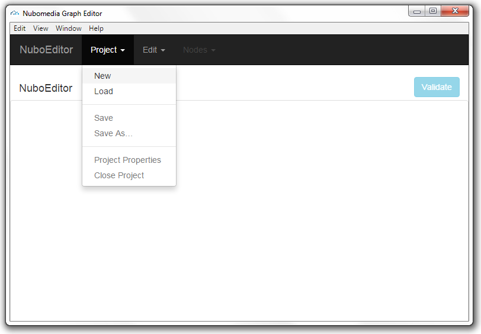
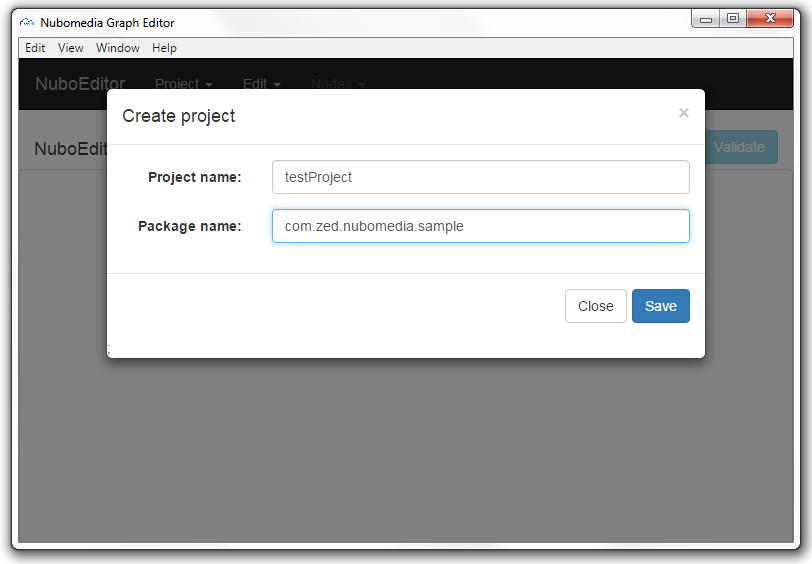
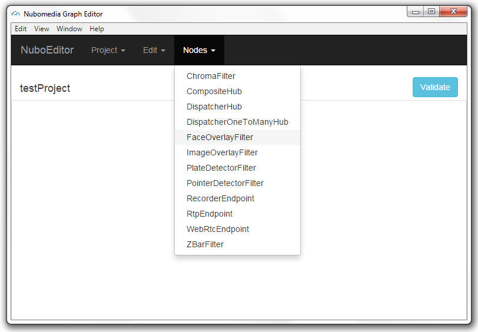
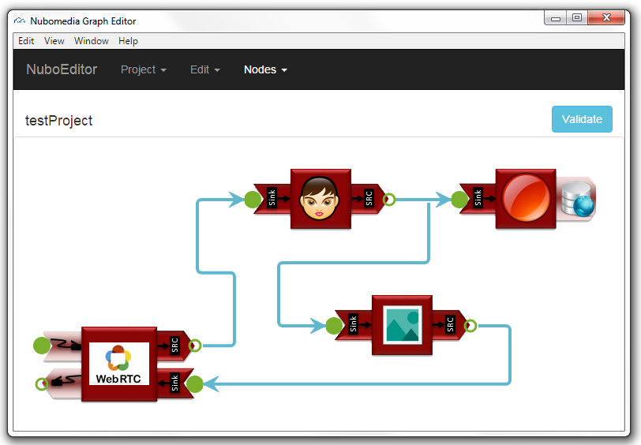
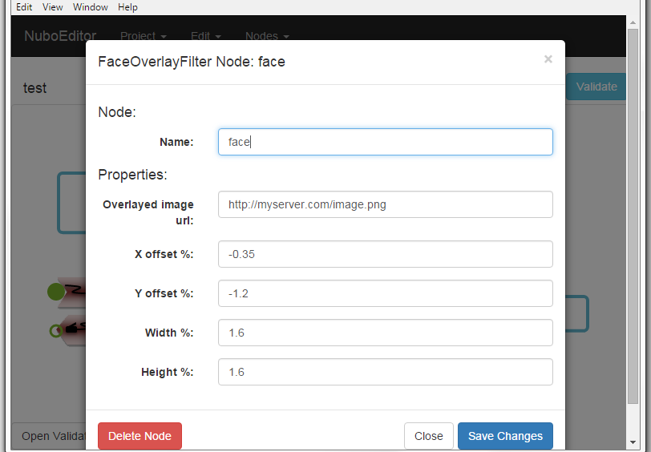
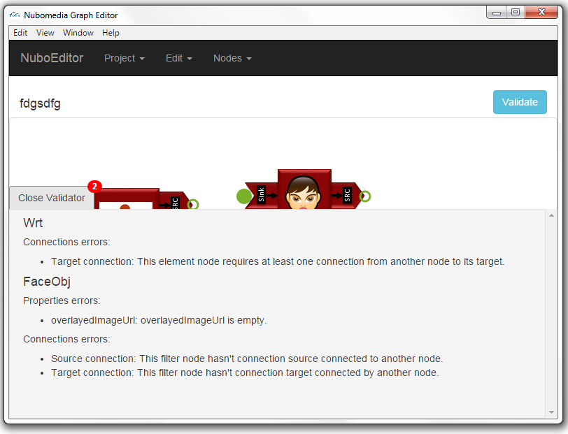
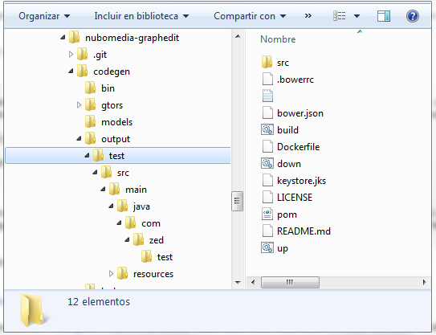

# Developers Guide

After following the [Installation Guide](installation.md) developers can start modelling applications using the Graph Tool. 
Launch de tool: 

`gulp electron` or `gulp`



## Create project

Create a new project from Project -> New.
The project must be given a package and a name and these will be the package name and the main class name in the generated code.



Now components can be added to the proyect from Nodes menu.



Once in the project, components can be connected dragging and dropping from/to source/target nodes.



Double click on any component to open its details where properties can be set. The component name can be changed to a readable string that will be used later as the object variable name in code.



Click on any component to select it, then you can use `edit`options to cut/copy/paste/delete.
Drag from any source point of any component to any sink to connect those nodes. 
Drag any side of one wire and drop outside to remove the connection.


## Validation

Before converting the model into code developers must "validate" the application with the validation option in the Graph Tool. This feature checks the model ensuring all the properties in each component have been filled and there are not orphan nodes in both or any of it sources and targets. 



When the model passes validation, the project can be saved.

## Convert to code

Follow the [Codegen Installation Guide](codegeninstall.md) if you have not installed the Codegen tool yet.
Now just launch the Codegen tool with the path to the saved model and the path to the folder where the project must be generated.
The Codegen tool is still a prototype of what should be in a future. Although the graph tool can generate any kind of model, the Codegen does only work with a basic use case of a webrtc component in loopback where any kind or amount of filters can be inserted between source and target streams. RecorderEndpoint is also supported.

```
bin/esl-nubo gen -m /path/to/your/model.ngeprj -o output
```

This will convert you `model.ngeprj` model into your `output` folder. 

A new folder will be created in `output` with the model name with the full source code for that model.



You can now review the generated code, your variable (model component) names, events, class names, package...

```
package com.zed.test;

...

import org.kurento.client.ZBarFilter;
import org.kurento.client.CodeFoundEvent;
import org.kurento.client.FaceOverlayFilter;
import org.kurento.client.ImageOverlayFilter;

...

webrtc = new WebRtcEndpoint.Builder(mediaPipeline).build();

ZBarFilter zbar = new ZBarFilter.Builder(mediaPipeline).build();
zbar.connect(webrtc);

FaceOverlayFilter face = new FaceOverlayFilter.Builder(mediaPipeline).build();
face.setOverlayedImage("http://mydomain.com/icon.png", -0.35f, -1.2f, 1.6f, 1.6f);
face.connect(zbar);

ImageOverlayFilter image = new ImageOverlayFilter.Builder(mediaPipeline).build();
image.addImage("123456", "http://mydomain.com/icon1.png", -0.35f, -1.2f, 1.6f, 1.6f, true, true);
image.connect(face);

webrtc.connect(image);

zbar.addCodeFoundListener(new EventListener<CodeFoundEvent>() {
  @Override
  public void onEvent(CodeFoundEvent event) {
    JsonObject response = new JsonObject();
    response.addProperty("id", "codeFound");
    response.addProperty("code", event.getValue());
    try {
        session.sendMessage(new TextMessage(response.toString()));
    } catch (Throwable t) {
        //TODO
    }
  }
});
```

At this point, developers can modify the application code to satisfy their business logic requirements. In the piece of code above, for example, developers should decide what to do in the event dispatched when a code bar is detected. Similar modifications should be done not only on events but also in any point where the developer needs propietary integrations such as database.

## Deploy

The generated project is ready to deploy with all the requirements and dependencies for Docker and Maven ready.
The project has to be deployed using the [Nubomedia PaaS](http://nubomedia.readthedocs.org/en/latest/paas/paas-introduction/). To be able to import into the PaaS, a Git repository is needed at this moment, developers must comit the generated project into a repository and finally, from the PaaS interface, deploy the application.

 